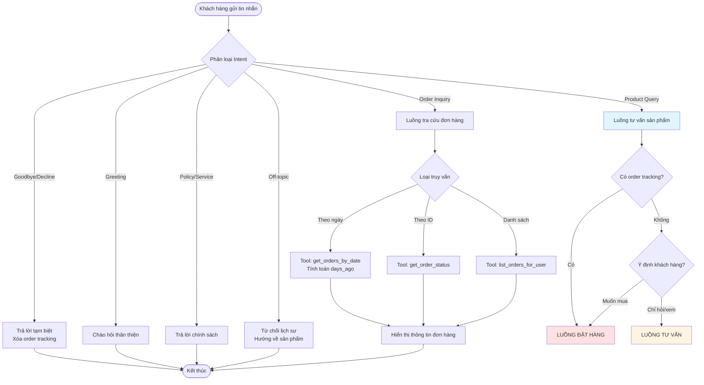
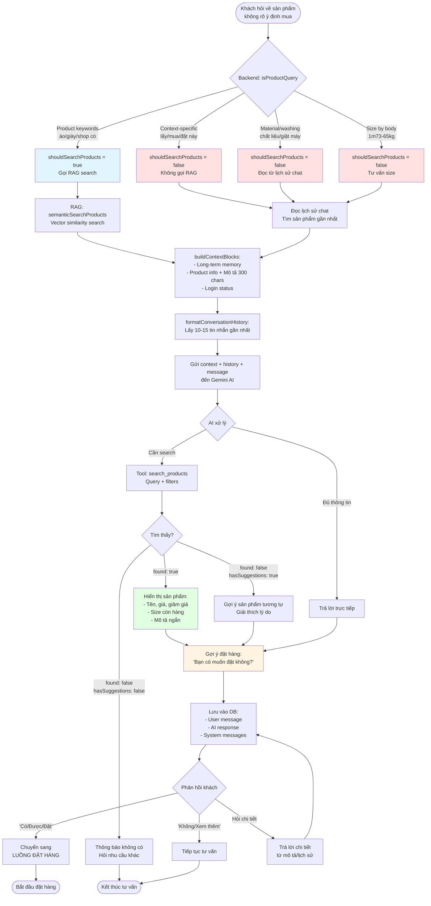
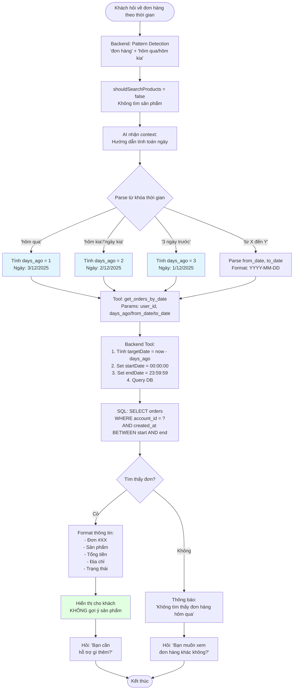
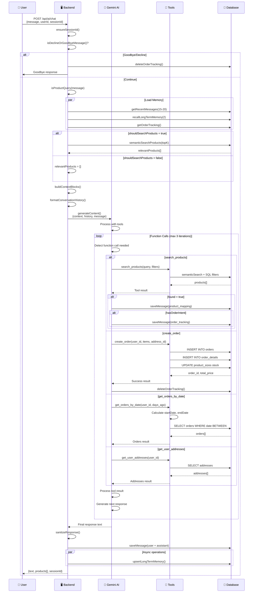

# AI Agent Flow - Tư Vấn Sản Phẩm

## 🎯 Tổng Quan Luồng Hoạt Động



## 📋 Luồng Tư Vấn Sản Phẩm (Consultation Flow)



## 🛒 Luồng Đặt Hàng (Order Placement Flow)

```mermaid
flowchart TD
    Start([Khách muốn mua sản phẩm]) --> DetectOrderIntent{Backend: Phát hiện intent}
    
    DetectOrderIntent -->|'mua/đặt/lấy + tên SP'| SearchProduct[Tool: search_products<br/>Tìm sản phẩm]
    DetectOrderIntent -->|'lấy/mua + này/đó'| ReadHistoryProduct[Đọc lịch sử<br/>Lấy product_id gần nhất]
    
    SearchProduct --> ProductFound{Tìm thấy?}
    ReadHistoryProduct --> CreateTracking
    
    ProductFound -->|Có| CreateTracking[Tạo system message:<br/>'📦 Đang xử lý đơn:<br/>product_id=XX, product_name=...']
    ProductFound -->|Không| NotifyNotFound[Thông báo không có<br/>Gợi ý tương tự]
    
    NotifyNotFound --> End([Kết thúc])
    
    CreateTracking --> SaveTracking[Lưu vào DB:<br/>role='system'<br/>tool_name='order_tracking']
    
    SaveTracking --> Step1[BƯỚC 1: Hiển thị sản phẩm<br/>+ Hỏi size]
    
    Step1 --> WaitSize[Đợi khách trả lời]
    
    WaitSize --> CheckSizePattern{Pattern size?}
    
    CheckSizePattern -->|'M'/'size L'| SingleSize[Lưu 1 size<br/>→ Bước 2]
    CheckSizePattern -->|'M 2 cái, L 1 cái'| MultiSize[Lưu nhiều size + số lượng<br/>→ Skip bước 2, 3]
    CheckSizePattern -->|'1m73-65kg'| RecommendSize[Tư vấn size M hoặc L<br/>→ Hỏi lại]
    
    RecommendSize --> WaitSize
    
    SingleSize --> Step2[BƯỚC 2: Hỏi số lượng]
    
    Step2 --> WaitQuantity[Đợi khách trả lời]
    
    WaitQuantity --> SaveQuantity[Lưu số lượng<br/>→ Bước 3]
    
    MultiSize --> Step3
    SaveQuantity --> Step3[BƯỚC 3: Lấy địa chỉ]
    
    Step3 --> GetAddresses[Tool: get_user_addresses<br/>Lấy danh sách địa chỉ đã lưu]
    
    GetAddresses --> HasAddress{Có địa chỉ?}
    
    HasAddress -->|Có| DisplayAddresses[Hiển thị danh sách:<br/>1️⃣ Tên - SĐT - Địa chỉ<br/>2️⃣ Tên - SĐT - Địa chỉ]
    HasAddress -->|Không| AskNewAddress[Yêu cầu nhập địa chỉ mới:<br/>Tên, SĐT, Tỉnh, Quận, Phường, Địa chỉ]
    
    DisplayAddresses --> WaitAddressChoice[Đợi khách chọn số]
    AskNewAddress --> WaitNewAddress[Đợi khách nhập]
    
    WaitAddressChoice --> ParseChoice[Parse lựa chọn:<br/>'1'/'số 1' → addresses[0].id]
    WaitNewAddress --> ValidateAddress[Validate địa chỉ mới]
    
    ParseChoice --> Step4
    ValidateAddress --> Step4[BƯỚC 4: Tạo đơn hàng]
    
    Step4 --> PrepareOrderData[Chuẩn bị dữ liệu:<br/>- user_id<br/>- items: product_id, size, qty<br/>- address_id]
    
    PrepareOrderData --> CreateOrder[Tool: create_order<br/>Tạo đơn hàng trong DB]
    
    CreateOrder --> OrderSuccess{Thành công?}
    
    OrderSuccess -->|Có| DeleteTracking[Xóa order tracking<br/>Hoàn tất đơn hàng]
    OrderSuccess -->|Lỗi| HandleError[Xử lý lỗi:<br/>- Thiếu thông tin → Hỏi lại<br/>- Hết hàng → Thông báo<br/>- Lỗi DB → Báo lỗi]
    
    DeleteTracking --> DisplaySuccess[Hiển thị thành công:<br/>✅ Đơn hàng #XX<br/>💰 Tổng tiền: XXXđ<br/>🚚 Địa chỉ: ...]
    
    HandleError --> RetryOrCancel{Khách muốn?}
    
    RetryOrCancel -->|Thử lại| Step1
    RetryOrCancel -->|Hủy| CancelOrder[Xóa order tracking<br/>Kết thúc]
    
    DisplaySuccess --> AskMore[Hỏi: 'Bạn cần hỗ trợ gì thêm?']
    
    AskMore --> End([Kết thúc đặt hàng])
    CancelOrder --> End
    
    style CreateTracking fill:#ffe1e1
    style Step1 fill:#e1f5ff
    style Step2 fill:#e1f5ff
    style Step3 fill:#e1f5ff
    style Step4 fill:#e1f5ff
    style DisplaySuccess fill:#e1ffe1
```

## 🔍 Luồng Tra Cứu Đơn Hàng Theo Ngày



## 🧠 Cơ Chế Context & Memory

```mermaid
flowchart LR
    subgraph Input [📥 Input Processing]
        UserMsg[User Message] --> SessionID[Session ID<br/>user-{userId}]
        SessionID --> LoadMemory[Load Memory]
    end
    
    subgraph Memory [🧠 Memory System]
        LoadMemory --> RecentHistory[Recent History<br/>15-20 tin nhắn gần nhất]
        LoadMemory --> LongTermMem[Long-term Memory<br/>Vector similarity<br/>2 memories]
        LoadMemory --> OrderTracking[Order Tracking<br/>System messages<br/>📦 Đang xử lý đơn...]
    end
    
    subgraph RAG [🔍 RAG Search]
        ShouldSearch{shouldSearchProducts?} -->|Yes| VectorSearch[Semantic Search<br/>Embedding similarity]
        ShouldSearch -->|No| SkipRAG[Skip RAG<br/>relevantProducts = []]
        
        VectorSearch --> TopK[Top-K products<br/>k = 3-5]
    end
    
    subgraph Context [📦 Context Building]
        TopK --> BuildBlocks[buildContextBlocks:<br/>1. Login status<br/>2. Long-term memory<br/>3. Product info + Mô tả]
        SkipRAG --> BuildBlocks
        OrderTracking --> PrependTracking[Prepend order tracking<br/>Ưu tiên cao nhất]
        BuildBlocks --> PrependTracking
        
        RecentHistory --> FormatHistory[formatConversationHistory:<br/>- Filter user/assistant/system<br/>- Slice -10 messages<br/>- Truncate: user 300, AI 200 chars]
        
        PrependTracking --> FinalContext[Final Context]
        FormatHistory --> FinalContext
    end
    
    subgraph AI [🤖 AI Processing]
        FinalContext --> Gemini[Gemini AI Model<br/>+ System Prompt<br/>+ Tools]
        UserMsg --> Gemini
        
        Gemini --> FunctionCall{Function Call?}
        
        FunctionCall -->|Yes| ExecuteTools[Execute Tools:<br/>- search_products<br/>- create_order<br/>- get_orders_by_date<br/>etc.]
        FunctionCall -->|No| GenerateText[Generate Response Text]
        
        ExecuteTools --> ToolResults[Tool Results]
        ToolResults --> Gemini
    end
    
    subgraph Output [📤 Output Processing]
        GenerateText --> Sanitize[Sanitize Response:<br/>- Remove tracking messages<br/>- Clean product codes<br/>- Format sizes<br/>- Add image notice]
        
        Sanitize --> SaveDB[Save to DB:<br/>- User message<br/>- AI response<br/>- Tool calls<br/>- System messages]
        
        SaveDB --> UpdateLongTerm[Update Long-term Memory<br/>Async, non-blocking]
        
        SaveDB --> Response[Return Response:<br/>- text<br/>- products<br/>- sessionId]
    end
    
    Response --> End([Frontend Display])
    
    style VectorSearch fill:#e1f5ff
    style BuildBlocks fill:#fff4e1
    style Gemini fill:#ffe1e1
    style SaveDB fill:#e1ffe1
```

## 🎨 Pattern Detection Logic

```mermaid
flowchart TD
    Start([Input Message]) --> Normalize[Normalize:<br/>toLowerCase]
    
    Normalize --> Check1{Context-specific?}
    
    Check1 -->|'lấy/mua/đặt + này'| Match1[✅ Order confirmation<br/>shouldSearch = false]
    Check1 -->|'1m73-65kg'| Match2[✅ Size by body<br/>shouldSearch = false]
    Check1 -->|'size L đi'| Match3[✅ Size/quantity input<br/>shouldSearch = false]
    Check1 -->|'chất liệu gì'| Match4[✅ Material question<br/>shouldSearch = false]
    Check1 -->|'giặt máy được ko'| Match5[✅ Washing question<br/>shouldSearch = false]
    
    Check1 -->|No match| Check2{Greeting?}
    
    Check2 -->|'xin chào'/'hi'| Match6[✅ Greeting<br/>shouldSearch = false]
    Check2 -->|No| Check3{Small talk?}
    
    Check3 -->|'cảm ơn'/'ok'| Match7[✅ Small talk<br/>shouldSearch = false]
    Check3 -->|No| Check4{Order inquiry?}
    
    Check4 -->|'đơn hàng' + 'hôm qua'| Match8[✅ Order inquiry<br/>shouldSearch = false]
    Check4 -->|No| Check5{Policy?}
    
    Check5 -->|'bao lâu giao'/'phí ship'| Match9[✅ Policy question<br/>shouldSearch = false]
    Check5 -->|No| Check6{Off-topic?}
    
    Check6 -->|'python'/'thời tiết'| Match10[✅ Off-topic<br/>shouldSearch = false]
    Check6 -->|No| Check7{Product keywords?}
    
    Check7 -->|'áo'/'giày'/'mua'| Match11[✅ Product query<br/>shouldSearch = true]
    Check7 -->|No| Check8{Long message?}
    
    Check8 -->|length > 30| Match12[✅ Likely product<br/>shouldSearch = true]
    Check8 -->|No| Default[❌ Not product query<br/>shouldSearch = false]
    
    Match1 --> RAGDecision
    Match2 --> RAGDecision
    Match3 --> RAGDecision
    Match4 --> RAGDecision
    Match5 --> RAGDecision
    Match6 --> RAGDecision
    Match7 --> RAGDecision
    Match8 --> RAGDecision
    Match9 --> RAGDecision
    Match10 --> RAGDecision
    Match11 --> RAGDecision
    Match12 --> RAGDecision
    Default --> RAGDecision
    
    RAGDecision{shouldSearchProducts?}
    
    RAGDecision -->|true| DoRAG[Gọi semanticSearchProducts<br/>Vector search + filters]
    RAGDecision -->|false| SkipRAG[relevantProducts = []<br/>Dùng lịch sử chat]
    
    DoRAG --> Continue([Tiếp tục xử lý])
    SkipRAG --> Continue
    
    style Match1 fill:#ffe1e1
    style Match2 fill:#ffe1e1
    style Match3 fill:#ffe1e1
    style Match4 fill:#ffe1e1
    style Match5 fill:#ffe1e1
    style Match11 fill:#e1ffe1
    style Match12 fill:#e1ffe1
    style DoRAG fill:#e1f5ff
```

## 📊 Tool Execution Flow



## 🏗️ Kiến Trúc Tổng Thể

```mermaid
graph TB
    subgraph Frontend [🖥️ Frontend - React]
        UI[User Interface] --> ChatAPI[API Client]
    end
    
    subgraph Backend [⚙️ Backend - Node.js/Express]
        Router[/api/ai/chat] --> Controller[aiController.js]
        
        Controller --> IntentDetect[Intent Detection<br/>isProductQuery]
        Controller --> MemoryLoader[Memory Loader<br/>getRecentMessages]
        
        IntentDetect --> RAGEngine[RAG Engine<br/>semanticSearchProducts]
        
        subgraph AI_Services [🤖 AI Services]
            PromptBuilder[prompts.js<br/>System Prompt + Context]
            GeminiAPI[gemini.js<br/>AI Model Interface]
            VectorStore[vectorStore.js<br/>Embedding Search]
            ToolsImpl[tools.js<br/>Function Implementations]
        end
        
        RAGEngine --> VectorStore
        MemoryLoader --> PromptBuilder
        PromptBuilder --> GeminiAPI
        GeminiAPI --> ToolsImpl
    end
    
    subgraph External [☁️ External Services]
        Gemini[Google Gemini AI<br/>gemini-1.5-flash]
        EmbedAPI[Embedding API<br/>text-embedding-004]
    end
    
    subgraph Database [💾 Database - MySQL]
        Messages[conversation_history<br/>User/AI messages]
        Products[product<br/>Product catalog]
        Orders[orders + order_details<br/>Order data]
        Addresses[address<br/>User addresses]
        LongMem[long_term_memory<br/>Vector embeddings]
        ProdEmbed[product_embeddings<br/>Product vectors]
    end
    
    ChatAPI --> Router
    GeminiAPI --> Gemini
    VectorStore --> EmbedAPI
    
    ToolsImpl --> Products
    ToolsImpl --> Orders
    ToolsImpl --> Addresses
    
    VectorStore --> ProdEmbed
    MemoryLoader --> Messages
    MemoryLoader --> LongMem
    
    Controller --> Messages
    
    style Frontend fill:#e1f5ff
    style Backend fill:#fff4e1
    style AI_Services fill:#ffe1e1
    style External fill:#f0f0f0
    style Database fill:#e1ffe1
```

## 📝 Ghi Chú Quan Trọng

### Optimization Points:
1. **Parallel Loading**: Recent history, long-term memory, order tracking load song song
2. **Early Exit**: Goodbye/decline được xử lý ngay, không gọi AI
3. **Smart RAG**: Chỉ gọi vector search khi cần, skip khi context-specific
4. **Async Saves**: Lưu database không blocking response
5. **Retry Logic**: Exponential backoff 300ms → 450ms → 675ms
6. **Model Fallback**: Gemini 1.5 Flash → Fast model nếu lỗi

### Memory Management:
- **Recent History**: 15-20 messages (fast: 10-15), slice cuối 10 messages
- **Long-term Memory**: Top-2 relevant memories by vector similarity
- **Order Tracking**: System messages với role='system', tool_name='order_tracking'
- **Product Mapping**: Lưu product_id mapping để dễ trace

### Pattern Detection Priority:
1. Context-specific (order confirmation, material questions)
2. Greetings
3. Small talk
4. Order inquiry (với time keywords)
5. Policy questions
6. Off-topic
7. Product keywords
8. Long messages (>30 chars)

---

**Tạo bởi**: AI Agent Flow Documentation
**Ngày**: 4/12/2025
**Version**: 1.0
